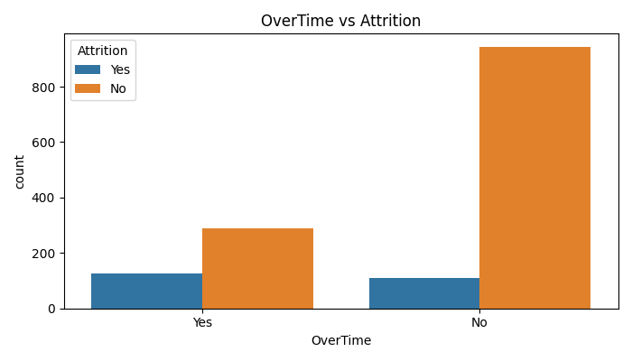
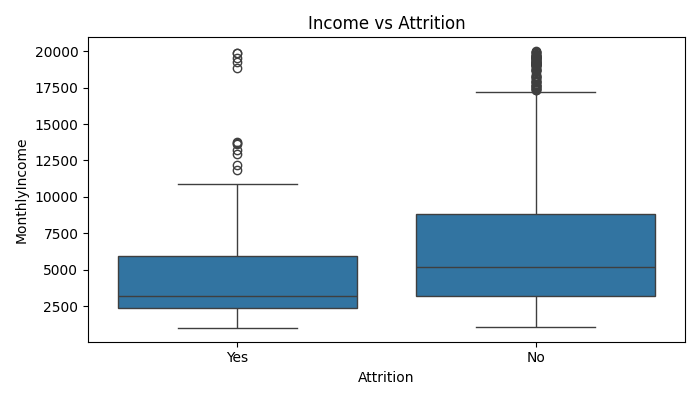
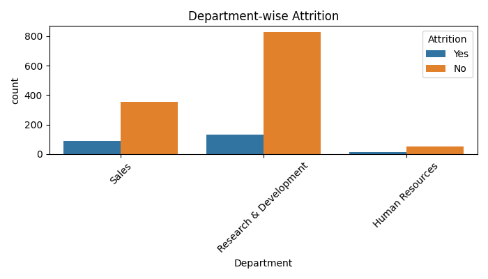
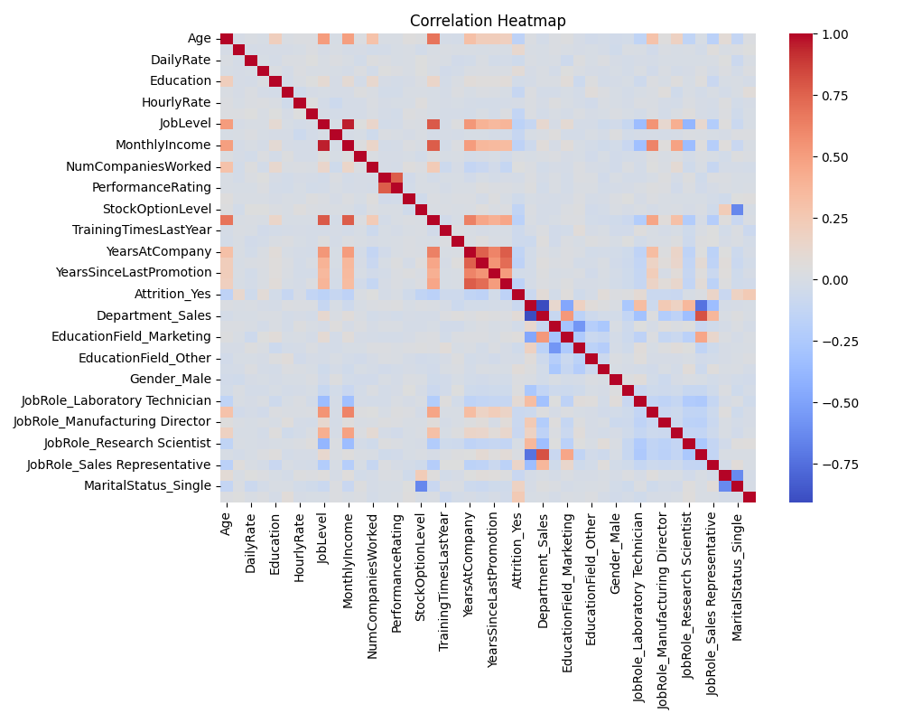

# Employee Attrition Prediction for HR

A machine learning project to predict employee attrition and identify factors associated with employees leaving an organization. The goal is to support HR teams with data-driven insights for better retention decisions.

---

## Problem Statement

Employee attrition leads to increased hiring costs, productivity loss, and disruption in teams.

This project answers two key questions:

- Who is likely to leave?
- What factors are associated with attrition?

---

## Dataset

- Dataset: IBM HR Analytics Employee Attrition Dataset
- Records: 1,470 employees
- Target Variable: Attrition (Yes / No)
- Features: Demographics, job role, income, experience, satisfaction metrics, etc.

Note: Dataset is publicly available on Kaggle and is not stored in this repository.

---

## Approach

### Data Preprocessing

- Removed irrelevant columns (EmployeeNumber, etc.)
- Converted categorical variables:
  - Ordinal → Label Encoding
  - Nominal → One-Hot Encoding
- No missing values in dataset

---

### Exploratory Data Analysis (EDA)

The following patterns were observed:

- Employees working overtime tend to leave more frequently
- Employees with lower monthly income show higher attrition
- Attrition varies across departments and job roles
- No single feature alone explains attrition; multiple factors contribute

---

## Model Building

Two classification models were trained:

### Logistic Regression (Final Model)

- Accuracy: ~71.7%
- Recall (Attrition = Yes): ~59%

### Random Forest

- Accuracy: ~84.6%
- Recall (Attrition = Yes): ~23%

---

## Model Selection

Although Random Forest achieved higher accuracy, it performed poorly in identifying employees who are likely to leave.

Logistic Regression was selected because it identifies more actual attrition cases, making it more useful for HR decision-making.

---

## Key Insights

- OverTime: Employees working overtime are more likely to leave
- MonthlyIncome: Lower income is associated with higher attrition
- YearsAtCompany / YearsInCurrentRole: Long tenure without growth increases attrition risk
- Department: Sales and R&D show higher attrition compared to HR

---

## Visualizations

### OverTime vs Attrition


### Income vs Attrition


### Department-wise Attrition


### Correlation Heatmap


---

## Risk Profiling

Employees with predicted probability greater than 0.6 are classified as high-risk employees.

This helps HR teams:
- Identify potential attrition early
- Take preventive actions

---

## Recommendations

- Monitor and reduce excessive overtime
- Review compensation for lower income groups
- Provide career growth and internal mobility
- Focus retention strategies on high-attrition departments

---

## Project Structure
## Project Structure

```
Employee-Attrition-Prediction/
│
├── Attrition_model.ipynb
├── README.md
├── Report.pdf
├── images/
│   ├── overtime.png
│   ├── income.png
│   ├── department.png
│   └── heatmap.png


---

## Conclusion

This project demonstrates how machine learning can be used to analyze employee data and identify patterns related to attrition.

Logistic Regression was selected as the final model because it better identifies employees who are likely to leave, making it more useful for real-world HR decision-making.

The insights from this project can help organizations take proactive steps to improve employee retention and workforce stability.
```
